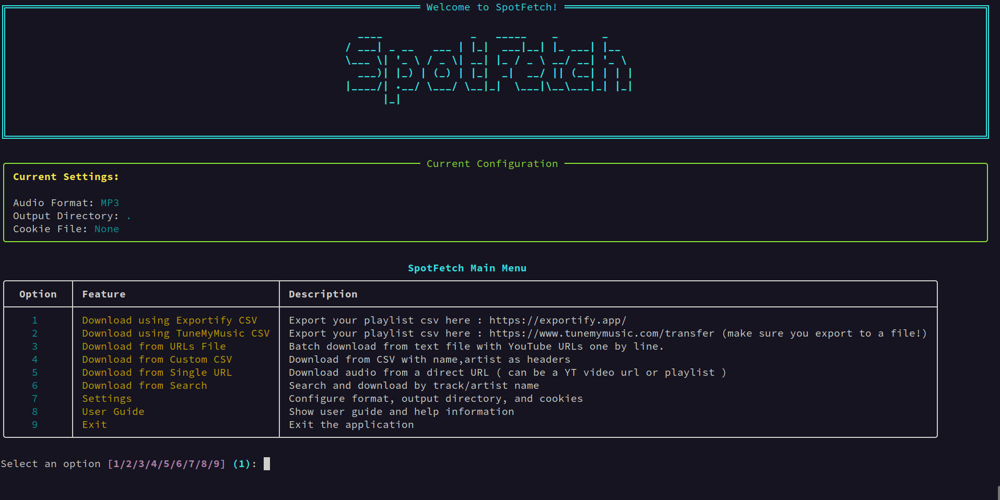

# SpotFetch :




A simple python program to download Music from various platfroms using yt-dlp ( The audio source is YouTube ).

## What it can do :

- Download Spotify playlists after exporting the playlist as a csv file from [Exportify](https://exportify.app)
- Download your music library and playlists after exporting as a csv file from [TuneMyMusic](https://www.tunemymusic.com/), which supports a large number of platforms : Spotify, Deezer, Apple Music, Youtube Music, soundcloud, last.fm ... and much more, see the list [here](https://www.tunemymusic.com/transfer), tho using Exportify is recommended since its [opensourced](https://github.com/watsonbox/exportify) and not commercial like TuneMyMusic.
- You can also batch download music from a .txt file with URLs one by line.
- Or batch download using a custom CSV file with headers *name,artist*
- Direct download from a Youtube url, can be a video or playlist.
- Search then download a song using its name and artist name.
- Audio is downloaded as either MP3, M4A, or FLAC.
- Song cover or thumbnail are always embedded, alongside numerous metadata.
- You can use a cookie file in case YouTube rate limits you session.

# Installation :

## PC :
### Requirements :

- First make sure you have ffmpeg installed on your machine [Download here](https://ffmpeg.org/download.html).
- Make sure you have [Python](https://www.python.org/downloads/) installed too, and is in you system path.
- If you dont have Git to clone the repo thats fine, you can download it as a zip file and uncompress it, see [here](.github/if_no_git.png).

### setup :

- Clone this repository ( or just download it as a zip file and uncompress it ):

```bash
git clone https://github.com/MrElyazid/SpotFetch.git
```

- then :

```bash
cd SpotFetch
```

- Install `requirements.txt` ( preferably use a new virtual environement, helpful for updating yt-dlp later ):

```bash
pip install -r requirements.txt
```

- Thats it, now run `menu.py` :

```bash
python3 menu.py
# or python menu.py
# or py menu.py
```

### note :
It is recommended to use a virtual environement for SpotFetch since installing requirments globally on your machine is generally bad,
before running `pip install -r requirements.txt` make sure you [create](https://docs.python.org/3/library/venv.html#creating-virtual-environments) and then [activate](https://docs.python.org/3/library/venv.html#how-venvs-work) a venv, and if on Windows and running powershell you might need to run `Set-ExecutionPolicy -ExecutionPolicy RemoteSigned -Scope CurrentUser` before activating the venv.

## Mobile, via [Termux](https://f-droid.org/en/packages/com.termux/) :
( you can also find Termux on Google play )

since SpotFetch is a python program, anywhere you can run python and ffmpeg, you can use SpotFetch,
you can use it from mobile using Termux by using the following commands on Termux :

*Ill add them later, too tired rn*

# Some details :

SpotFetch uses [Rich](https://github.com/Textualize/rich) for the Terminal UI, [Mutagen](https://github.com/quodlibet/mutagen) for metadata handling when downloading using Exportify and most importantly it uses [yt-dlp](https://github.com/yt-dlp/yt-dlp).

### why are only three audio formats supported ?
I will incrementaly support formats that allow thumbnail embedding ( 'mp3', 'mkv', 'mka', 'ogg', 'opus', 'flac', 'm4a', 'mp4', 'm4v', 'mov' ) and offer an option to download directly using yt-dlp's `bestaudio` format and fallback to m4a if the resulting format doesnt support embedding, when i tried this i had some issues especially with container formats like mp4, and also because if we want to embed Exportify metadata to these formats we need special handling for each one using mutagen, which is why i decided to stick with just :

- MP3 : most compatble.
- M4A : a mix between quality and compression.
- FLAC : because its lossless,  ( tho YouTube videos are lossy ).

### how to use a cookie file ?:

Use the following extensions to get cookies for YouTube depending on your browser : [Chrome](https://chromewebstore.google.com/detail/get-cookiestxt-locally/cclelndahbckbenkjhflpdbgdldlbecc?pli=1), [Firefox](https://addons.mozilla.org/en-US/firefox/addon/cookies-txt/).

You can read more about using cookies with yt-dlp [here](https://github.com/yt-dlp/yt-dlp/wiki/FAQ#how-do-i-pass-cookies-to-yt-dlp)

## Contributing :
If you have any enhancement ideas for the program or encountered a bug, you can submit an issue or a PR.
