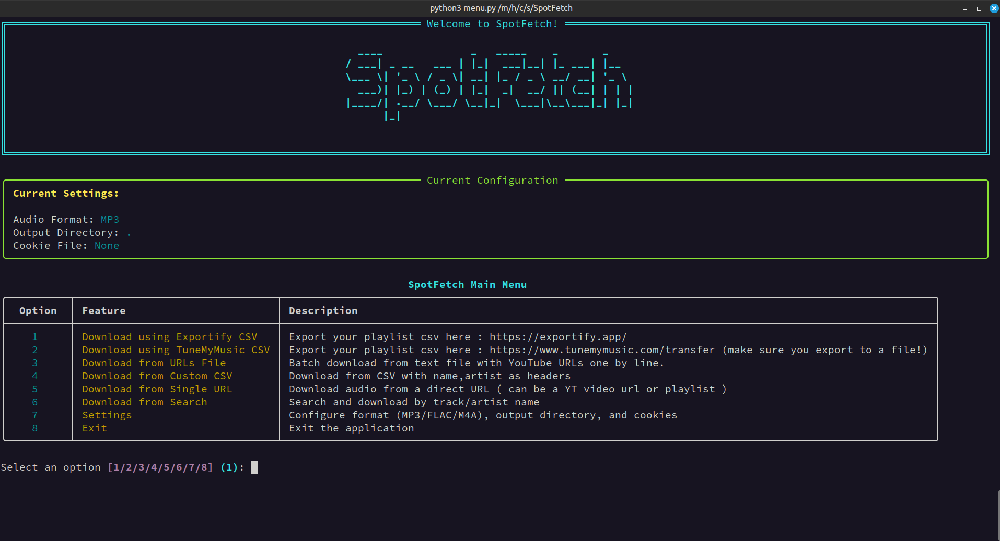

# SpotFetch :




A simple python program to download Music from various platfroms using yt-dlp ( The audio source is YouTube ).

## What it can do :

- Download Spotify playlists after exporting the playlist as a csv file from [Exportify](https://exportify.app)
- Download your music library after exporting it as a csv file from [TuneMyMusic](https://www.tunemymusic.com/), which supports a large number of platforms : Spotify, Deezer, Apple Music, Youtube Music, soundcloud, last.fm ... and much more, see the list [here](https://www.tunemymusic.com/transfer), but using Exportify is recommended since its [opensourced](https://github.com/watsonbox/exportify) and not commercial like TuneMyMusic.
- You can also batch download music from a .txt file with URLs one by line.
- Or batch download using a custom CSV file with headers *name,artist*
- Direct download from a Youtube url, can be a video or playlist.
- Search then download a song using its name and artist name.
- Audio is downloaded as either MP3, M4A, or FLAC.
- Song cover or thumbnail are always embedded, alongside numerous metadata.
- You can use a cookie file in case YouTube rate limits your session.

# Installation :

### Requirements :

- First make sure you have ffmpeg installed on your machine [Download here](https://ffmpeg.org/download.html).
- Make sure you have [Python](https://www.python.org/downloads/) installed too, and is in your system path.
- If you dont have Git to clone the repo thats fine, you can download it as a zip file and uncompress it, see [here](.github/if_no_git.png).

### setup :

- Clone this repository ( or just download it as a zip file and uncompress it ):

```bash
git clone https://github.com/MrElyazid/SpotFetch.git
```

- then :

```bash
cd SpotFetch
```

- Install `requirements.txt` ( preferably use a new virtual environement ):

```bash
pip install -r requirements.txt
```

- Thats it, now run `menu.py` :

```bash
python3 menu.py
# or python menu.py
# or py menu.py
```

### note :
It is recommended to use a virtual environement for SpotFetch since installing requirements globally on your machine is generally bad,
before running `pip install -r requirements.txt` make sure you [create](https://docs.python.org/3/library/venv.html#creating-virtual-environments) and then [activate](https://docs.python.org/3/library/venv.html#how-venvs-work) a venv, and if on Windows and running powershell you might need to run `Set-ExecutionPolicy -ExecutionPolicy RemoteSigned -Scope CurrentUser` before activating the venv.


## Some details :

SpotFetch uses [Rich](https://github.com/Textualize/rich) for the Terminal UI, [Mutagen](https://github.com/quodlibet/mutagen) for metadata handling when downloading using Exportify, and at its core its just a wrapper for [yt-dlp](https://github.com/yt-dlp/yt-dlp).

### why are only three audio formats supported ?
I will incrementally support formats that allow thumbnail embedding ( 'mp3', 'mkv', 'mka', 'ogg', 'opus', 'flac', 'm4a', 'mp4' ) and offer an option to download directly using yt-dlp's `bestaudio` format and fallback to m4a if the resulting format doesnt support thumbnail embedding ( F$!# WEBM !), when i tried this i had some issues especially with container formats like mp4, and also because if we want to embed Exportify metadata to these formats we need special handling for each one using mutagen, which is why i decided to stick with just :

- MP3 : most compatible.
- M4A : a mix between quality and compression.
- FLAC : because its lossless.

### How does the program set the best quality and bitrate ?

First off, YouTube uses adaptive streaming, the best available quality for a video can change depending on variables like the server load, location ... etc, to get the best available quality at the time of the request, the argument `bestaudio` for yt-dlp ensures we get the best quality available at the time of the download, and then comes the transcoding, when converting from the `bestaudio` format ( which is often opus or vorbis in WebM containers ) to `mp3` or `m4a` the argument `prefferedqyality: '0'` is used, this ensures we dont produce a bloated transcode and perform VBR encoding instead of just setting the maximum bitrate which will just result in a large file size for the audio, note that for `flac` this last argument is ignored since the format is lossless.

in short : **the best quality possible is always chosen.**

### how to use a cookie file ?:

Use the following extensions to get cookies for YouTube depending on your browser : [Chrome](https://chromewebstore.google.com/detail/get-cookiestxt-locally/cclelndahbckbenkjhflpdbgdldlbecc?pli=1), [Firefox](https://addons.mozilla.org/en-US/firefox/addon/cookies-txt/).

You can read more about using cookies with yt-dlp [here](https://github.com/yt-dlp/yt-dlp/wiki/FAQ#how-do-i-pass-cookies-to-yt-dlp)

### Download Platform Selection

SpotFetch allows you to choose between YouTube and YouTube Music for query-based downloads (e.g., search, CSV imports). This affects how search queries are handled:

- **YouTube Music** (default): Works best for popular songs and if you don't want to download video clip audio.
- **YouTube**: Works best for niche and lesser-known songs and artists.

Configure this in the Settings menu (option 4). Direct URL downloads (e.g., from .txt files) always use YouTube.

simply put each link in a line with no quotes, example :
```bash
https://youtu.be/dQw4w9WgXcQ?si=zQ_s7NhWcPgEQ46b
https://youtu.be/6-8E4Nirh9s?si=e7LKPptaE6vEEI48
https://youtu.be/D7ab595h0AU?si=vjr5nI0jYlFfs7H3
```

### How should the custom CSV file look like ?
the headers are name,artist an example :
```bash
name,artist
"in the end","linkin park"
"under pressure","queen"
"time","pink floyd"
```

### I keep getting 403 Forbidden Error :

If you get `ERROR: unable to download video data: HTTP Error 403: Forbidden` when trying to download, this is probably because yt-dlp needs to be updated, you can run `pip install -r requirements.txt --upgrade` to update it.

Also if using a venv, make sure you activate it before each launch of the app.

## Using SpotFetch on Android :
since SpotFetch is just a python program, you can run it on any machine with python installed, you can run it on Android via [Termux](https://f-droid.org/en/packages/com.termux/) ( you can also find Termux on Google play ), after installation follow these commands :

- Upgrade your system packages :

```bash
pkg update && pkg upgrade
```
Make sure to type Enter whenever needed while upgrading.


- Install python, git, ffmpeg:

```bash
pkg install git python ffmpeg
```

- Clone this repo :

```bash
git clone https://github.com/MrElyazid/SpotFetch
```

- cd into the directory :

```bash
cd SpotFetch/
```
- install the requirements:

```bash
pip install -r requirements.txt
```

- Rotate Your phone :
do it so that the terminal UI doesnt look awful :/

- Run `menu.py` :

```bash
python menu.py
```

Thats it, after downloading try to locate where Termux stores files on your Android and access your downloaded files there.


## Contributing :
If you have any enhancement ideas for the program or encountered a bug ( i didnt test it extensively ), you can submit an issue or a PR, happy to help!
