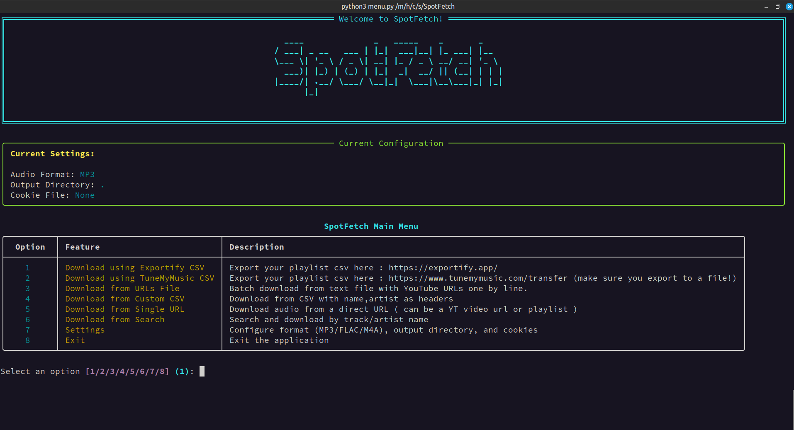

# SpotFetch :




A simple python program to download Music from various platfroms using yt-dlp ( The audio source is YouTube or YouTube Music ).

## What it can do :

- Download Spotify playlists after exporting the playlist as a csv file from [Exportify](https://exportify.net)
- batch download music from a .txt file with URLs one by line, or using a custom CSV file with headers *name,artist*
- Direct download from a Youtube url, can be a video or playlist.
- Search then download a song using its name and artist name.
- Audio is downloaded as MP3, M4A, or FLAC.
- Songs are downloaded alongside numerous metdata.
- You can use a cookie file in case YouTube rate limits your session.
- Download using either YouTube music or Youtube.
- You can download from platforms other than Spotify if you convert your playlists as CSVs using services like tunemymusic.com .

# Installation :

### Requirements :

- First make sure you have ffmpeg installed on your machine [Download here](https://ffmpeg.org/download.html).
- Install [UV](https://docs.astral.sh/uv/getting-started/installation/#__tabbed_1_2).
- If you dont have Git to clone the repo thats fine, you can download it as a zip file and uncompress it, see [here](.github/if_no_git.png).

### setup :

- Clone this repository ( or just download it as a zip file and uncompress it ):

```bash
git clone https://github.com/MrElyazid/SpotFetch.git
```

- then :

```bash
cd SpotFetch
```
- setup the project :

```bash
uv sync
```

- now run `uv run main.py` :

## Some details :

### I get `track_name error` or errors when parsing the csv :

Make sure the language set in Exportify is English.

### how to use a cookie file ?:

Use the following extensions to get cookies for YouTube depending on your browser : [Chrome](https://chromewebstore.google.com/detail/get-cookiestxt-locally/cclelndahbckbenkjhflpdbgdldlbecc?pli=1), [Firefox](https://addons.mozilla.org/en-US/firefox/addon/cookies-txt/).

You can read more about using cookies with yt-dlp [here](https://github.com/yt-dlp/yt-dlp/wiki/FAQ#how-do-i-pass-cookies-to-yt-dlp)
Note that you need to have a javascript runtime installed for the cookies to work, [deno](https://deno.com/) is recommended, read more here : https://github.com/yt-dlp/yt-dlp/wiki/EJS

### Download Platform Selection

- **YouTube Music** (default): Works best for popular songs and if you don't want to download video clip audio.
- **YouTube**: Works best for niche and lesser-known songs and artists.


### How should the urls txt file look like ?

simply put each link in a line with no quotes, example :
```bash
https://youtu.be/dQw4w9WgXcQ?si=zQ_s7NhWcPgEQ46b
https://youtu.be/6-8E4Nirh9s?si=e7LKPptaE6vEEI48
https://music.youtube.com/watch?v=k-3y2LVF_SE&si=G2Dtl4LUbzjGIcpy
```

### How should the custom CSV file look like ?

the headers are name,artist an example :
```bash
name,artist
"in the end","linkin park"
"under pressure","queen"
"time","pink floyd"
```

### I keep getting 403 Forbidden Error :

If you get `ERROR: unable to download video data: HTTP Error 403: Forbidden` when trying to download, this is probably because yt-dlp needs to be updated, you can run `uv sync` to update the packages.


## Contributing :

If you have any enhancement ideas for the program or encountered a bug, you can submit an issue or a PR or start a discussion, happy to help!
